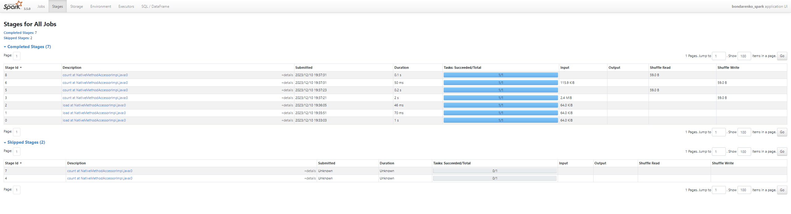

## Описание частей дз
### Part 1
Рассмотрим картинку с выполненными тасками в `Spark`:

На каждый `read` потребовалось по 1 стэйджу(3 чтения, одно тестовое). На `count()` потребовалось по 2 стэйджа, т.к. нужна операция `shuffle`.